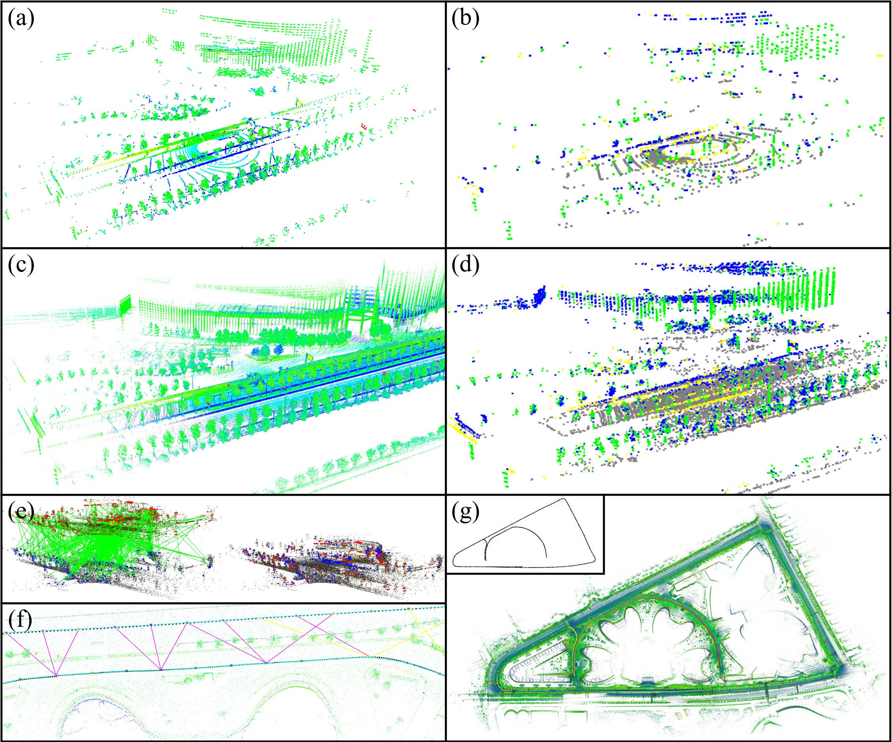

# MULLS
### MULLS: Versatile LiDAR SLAM via Multi-metric Linear Least Square 

MULLS is an efficient, low-drift, and versatile LiDAR-only SLAM system with both the front-end and back-end.  It's an overall updated version of [LLS-LOAM](https://github.com/YuePanEdward/LLS-LOAM). 

[[Video](https://www.youtube.com/watch?v=85bGD55e3-0&feature=youtu.be)], [[KITTI Leaderboard](http://www.cvlibs.net/datasets/kitti/eval_odometry.php)], [Preprint]

#### Codes coming soon.

--------

### 