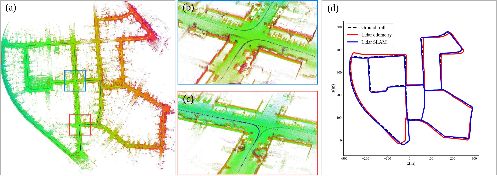
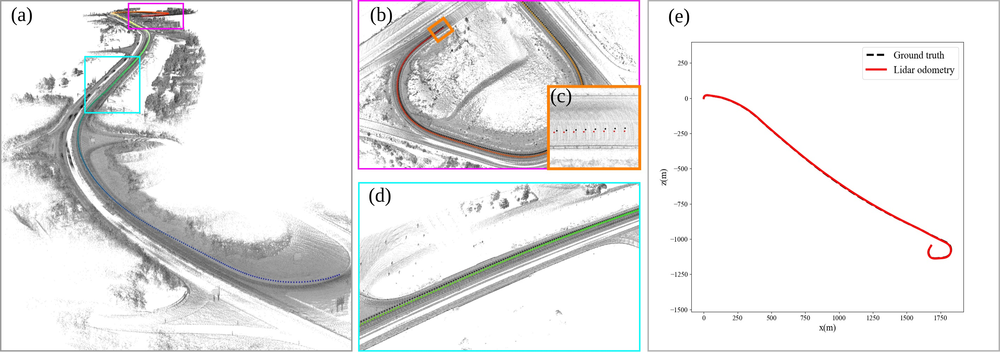

## MULLS: Versatile LiDAR SLAM via Multi-metric Linear Least Square 

MULLS is an efficient, low-drift, and versatile LiDAR-only SLAM system with both the front-end and back-end.  It's an overall updated version of [LLS-LOAM](https://github.com/YuePanEdward/LLS-LOAM). 

[[Video](https://www.youtube.com/watch?v=85bGD55e3-0&feature=youtu.be)], [[KITTI Leaderboard](http://www.cvlibs.net/datasets/kitti/eval_odometry.php)], [Preprint]

#### Version 1.0 (passed on Ubuntu 16.04 / 18.04) 
Codes are currently under reproducing for better readability and performance.

____________________________________________________________________________________

____________________________________________________________________________________

## Instruction

### 1. Install dependent 3rd libraries 

For a compiler that supports OpenMP

Compulsory:

- [PCL(>=1.7)](https://github.com/PointCloudLibrary/pcl)
- [Glog](https://github.com/google/glog)
- [Gflags](https://github.com/gflags/gflags)
- [Eigen 3](https://eigen.tuxfamily.org/dox/)

Optional:

- For *.las data IO: [LibLas](https://github.com/libLAS/libLAS)
- For *.h5 data IO: [HDF5](https://support.hdfgroup.org/HDF5/release/obtainsrc.html)
- For geo-coordinate projection for global mapping: [Proj4](https://proj.org/)
- For Lie-Group and Lie-Algebra related functions (only used in baseline registration method vgicp): [Sophus](https://github.com/strasdat/Sophus)
- For 2D map, scan range image and BEV image generation: [OpenCV](https://github.com/opencv/opencv) 
- For pose graph optimization: [g2o(<=2016version)](https://github.com/RainerKuemmerle/g2o/releases/tag/20160424_git)
- or [ceres](http://ceres-solver.org/)
- or [gtsam](https://bitbucket.org/gtborg/gtsam/src/develop/)
- For global registration using truncated least square: [TEASER++](https://github.com/MIT-SPARK/TEASER-plusplus)

You may run the following shell file to install all the dependent libs (tested on Ubuntu 16.04):
```
sh script/tools/install_dep_lib.sh
```

Note: ceres, g2o and gtsam are all used for pose graph optimization. You only need to install one of them (ceres is recommended).

### 2. Compile

```
mkdir build
cd build
cmake ..
make 
cd ..
```

If you'd like to configure the optional dependent libs needed by your task, you can directly switch the options in ```CMakeLists.txt``` and then rebuild (delete the ```build``` folder and do ```2.Compile``` again) or use ```ccmake ..``` in ```build``` folder instead. 

### 3. Prepare data

##### Test on KITTI

Download the [KITTI Odometry Dataset](http://www.cvlibs.net/datasets/kitti/eval_odometry.php) to test the project.

To test the semantic mask aided solution, please download the [Semantic KITTI Odometry Dataset](http://semantic-kitti.org/).

The complete data folder structure should be as following:

```
Base Folder
_____00
     |___velodyne [raw data *.bin]
     |___pcd [*.pcd]
     |___labels [raw semantic label *.label] (optional for semantic aided lidar odometry) 
     |___label_pcd [*.pcd] (optional for semantic aided lidar odometry) 
     |___00.txt [ground truth (gnssins) pose] (optional for evaluation)
     |___calib.txt [extrinsic transformation matrix (from body to lidar coordinate system)] (optional for evaluation)
_____01
     |___velodyne
     |___pcd
     |___labels
     |...
_____...
   
```

Scripts for converting the data format are available in ```./script/tool/``` folder.

You can use ```script/tools/run_kittibin2pcd.sh ``` to convert ```*.bin``` to ```*.pcd``` to get the ```pcd``` folder.
Similarly, you can use ```script/tools/run_semantic_kitti_labelbin2pcd.sh ``` to convert ```*.label``` to ```*.pcd``` to get the ```label_pcd``` folder.

##### Test on your own data

If you'd like to use your own data, the data format should be one of the following: ```*.pcd```, ```*.ply```, ```*.txt```, ```*.las```, ```*.h5```.
You can simply specify the data format in ```script/run_mulls_slam.sh```.

The data foler structure can be as simple as follows:

```
Base Folder
      |___dummy_framewise_point_cloud
      .    |___00001.pcd (las,txt,ply,h5...)
      .    |___00002.pcd (las,txt,ply,h5...)
      .    |___...
      |___dummy_ground_truth_trajectory.txt (optional)   
      |___dummy_calibration_file.txt (optional)  
```
Links to more open datasets are available [here](./script/tools/online_data_source.md). 

### 4. Run

#### MULLS-SLAM

If you'd like to test the LiDAR SLAM module (MULLS-SLAM), please edit the ```script/run_mulls_slam.sh``` file, specify the data path and then run:

```
sh script/run_mulls_slam.sh
```

If the visualization is enabled, then you can configure the visualization GUI by following the instructions below the main window.

For better performance on a specific dataset, you are suggested to play with the parameters in ```script/config/lo_gflag_list_[xxx].txt``` (tips on parameter tuning will be released in project Wiki), and then you need to change the config file path in ```script/run_mulls_slam.sh``` as following:

```
config_file=./script/config/lo_gflag_list_[xxx].txt
```

To disable or enable the back-end (loop closure detection and pose graph optimization), you can edit the ```--loop_closure_detection_on=true/false``` in the config file.

After the transaction, you are expected to find the results (plots, poses, evaluation results, generated 3D and 2D map ...) in the ```result``` folder under the data path.

#### MULLS-Registration

You can use ```script/run_mulls_reg.sh``` to test the pairwise point cloud registration using MULLS-ICP with TEASER++ simply by configuring the data path in it. Then you can run it by:

```
sh script/run_mulls_reg.sh
```

----------

### Demo

#### On KITTI dataset





----------------------------

### Contact

If you have any questions, please let me know:

**Yue Pan** {yuepan@ethz.ch}

---------

### TODO List

- [ ] Code reproducing

- [ ] Add preprint paper

- [ ] Add Wiki

- [ ] Add ROS support

- [ ] Add cross-platform support 

- [ ] Add sensor fusion module

- [ ] Test on more dataset

  

  


